# 타자연습 대전 게임 (Typing Battle Game)

> WebSocket 기반 실시간 멀티플레이어 타자연습 게임

## 📋 프로젝트 개요

타자 연습을 게임화하여 재미있게 학습할 수 있는 실시간 멀티플레이어 웹 게임입니다. 플레이어는 맵에 나타나는 단어를 입력하여 공격, 회복, 버프 등의 효과를 얻으며 다른 플레이어와 경쟁합니다.

### 핵심 가치

- **실시간 동기화**: WebSocket을 통한 지연 없는 멀티플레이어 경험
- **게임화 학습**: 타자 연습을 재미있는 게임 메커니즘으로 전환
- **확장 가능한 아키텍처**: 모듈화된 구조로 기능 추가 용이

## 🛠 기술 스택

### Frontend

- **Framework**: Next.js 14 (App Router)
- **Language**: TypeScript
- **UI**: React 18, Tailwind CSS
- **State Management**: React Context API
- **Real-time Communication**: Socket.IO Client 4.8
- **Styling**: Tailwind CSS, CSS Modules

### Backend

- **Framework**: NestJS 11
- **Language**: TypeScript
- **WebSocket**: Socket.IO (NestJS Platform)
- **Database**: Prisma ORM (PostgreSQL - Supabase)
- **Architecture**: Modular Architecture, Service Pattern

## 🎮 주요 기능

### 1. 실시간 멀티플레이어 게임

- 여러 플레이어가 동시에 접속하여 게임 플레이
- 실시간 위치 동기화 및 게임 상태 공유
- 초당 60회 게임 루프로 부드러운 게임 경험

### 2. 타자 연습 기반 게임플레이

- 맵에 랜덤으로 생성되는 단어 입력
- 단어 타입별 효과:
  - **공격 단어**: 가장 가까운 플레이어에게 데미지
  - **회복 단어**: 체력 회복
  - **속도 단어**: 이동 속도 증가 버프
  - **방어 단어**: 일정 시간 방어막 생성
  - **아이템 단어**: 인벤토리에 아이템 추가

### 3. 플레이어 커스터마이징

- 닉네임 및 스킨(이모지) 선택
- 실시간 플레이어 위치 추적
- 카메라가 플레이어를 따라가는 시스템

### 4. 관전 모드

- 게임에 참여하지 않고 관전만 가능한 모드
- 모든 플레이어의 상태를 실시간으로 확인

### 5. 게임 시스템

- 체력 시스템 (최대 100)
- 인벤토리 시스템 (최대 5개 슬롯)
- 버프 시스템 (속도 부스터, 방어막)
- 랭킹 시스템 (체력 기준)

## 🎯 구현하고자 한 기능

1. **실시간 멀티플레이어 동기화**
   - WebSocket을 통한 양방향 실시간 통신
   - 게임 상태의 일관성 유지
   - 지연 최소화

2. **확장 가능한 게임 로직**
   - 모듈화된 게임 서비스 구조
   - 새로운 단어 타입 및 효과 추가 용이
   - 플러그인 방식의 게임 메커니즘

3. **반응형 UI/UX**
   - 부드러운 애니메이션 및 이펙트
   - 직관적인 조작 방식
   - 실시간 피드백

## 🔧 시행착오와 해결

### 1. Prisma 데이터베이스 연결 실패로 인한 서버 시작 불가

**Problem (문제)**

- 백엔드 서버 시작 시 `PrismaClientInitializationError: FATAL: Tenant or user not found` 에러 발생
- Supabase 데이터베이스 연결 정보가 만료되었거나 잘못됨
- 데이터베이스 연결 실패로 인해 전체 서버가 시작되지 않음
- 데이터베이스 구현이 필수가 아님을 인지 한 후 백엔드 프로젝트를 수정하고 나서 데이터베이스 연결 모듈에 대한 예외처리를 하지 않아 발생한 문제였습니다.

**Action (조치)**

- PrismaService의 `onModuleInit`에서 에러 핸들러를 추가했습니다.
- 데이터베이스 연결 실패 시에도 게임 서버가 계속 실행되도록 수정, 에러 로깅을 통한 문제 추적 가능하도록 개선했습니다.

**Result (결과)**

- 데이터베이스 연결 문제와 무관하게 게임 서버 정상 작동하게 되었습니다.
- 향후 DB 기능 추가 시에도 유연하게 대응 가능한 구조로 개편했습니다.

---

### 2. 실시간 게임 상태 동기화 최적화

**Problem (문제)**

- 초기 구현 시 모든 게임 상태를 매 프레임마다 전송하여 네트워크 부하 발생하고, 불필요한 데이터 전송으로 인한 지연 및 성능 저하되는 것을 확인했습니다.
- 클라이언트 간 상태가 동기화되지 않을 수 있다고 파악했습니다.

**Action (조치)**

- 게임 루프를 초당 60회(16ms 간격)로 최적화
- 변경된 상태만 브로드캐스트하도록 이벤트 기반 시스템 도입
- 플레이어 위치 업데이트는 throttle 적용

**Result (결과)**

- 네트워크 트래픽 감소 및 지연 시간이 단축되는 것을 확인했습니다.
- 이전보다 부드러운 게임 경험을 제공하게 되었습니다.

---

### 3. 프론트엔드 상태 관리 복잡도 증가

**Problem (문제)**

- 게임 상태, 소켓 연결 상태, 플레이어 정보 등 여러 상태를 Props로 전달
- 컴포넌트 간 상태 공유가 복잡해짐
- 상태 업데이트 로직이 분산되어 유지보수 어려움

**Action (조치)**

- React Context API를 활용한 `GameStateManager` 구현
- 게임 관련 모든 상태를 중앙에서 관리
- 커스텀 훅(`useGame`)을 통한 간편한 상태 접근
- 소켓 이벤트 리스너를 Context 내부에서 관리

**Result (결과)**

- 컴포넌트 간 Props drilling 제거
- 상태 관리 로직의 중앙화로 유지보수성 향상
- 새로운 기능 추가 시 확장 용이
- 코드 가독성 및 재사용성 개선

---

### 4. 게임 루프와 렌더링 성능 최적화

**Problem (문제)**

- Canvas 렌더링이 매 프레임마다 전체를 다시 그려 성능 저하
- 게임 루프와 React 렌더링 사이클의 불일치
- 다수의 플레이어 및 단어 렌더링 시 프레임 드롭 발생

**Action (조치)**

- `requestAnimationFrame`을 활용한 효율적인 렌더링 루프 구현
- Canvas 컨텍스트의 `save()`/`restore()`를 활용한 카메라 변환 최적화
- 게임 상태 변경 시에만 리렌더링되도록 `useEffect` 의존성 최적화
- 이펙트 애니메이션을 별도 타이머로 관리하여 렌더링 부하 분산

**Result (결과)**

- 안정적인 60fps 유지할 수 있었습니다.
- 다수의 동시 플레이어 환경에서도 부드러운 렌더링이 가능했습니다.

---

### 5. 타입 안정성 확보

**Problem (문제)**

- 프론트엔드와 백엔드 간 데이터 구조 불일치 가능성
- 소켓 이벤트의 타입 정의 부재로 런타임 에러 위험
- 게임 상태 인터페이스의 일관성 유지 어려움

**Action (조치)**

- 공통 타입 정의 파일(`types/game.ts`) 생성하고 프론트엔드 / 백엔드가 이용하도록 했습니다.
- TypeScript의 엄격한 타입 체크 활성화
- 소켓 이벤트의 타입을 명시적으로 정의
- 프론트엔드와 백엔드 간 타입 일관성 유지

**Result (결과)**

- 컴파일 타임에 타입 오류 발견이 가능해졌습니다.
- 런타임 에러 감소 및 코드 신뢰성 향상되었습니다.

## 📊 성과 및 배운 점

### 기술적 성과

- **실시간 통신**: WebSocket을 활용한 양방향 실시간 통신을 구현할 수 있었습니다.
- **게임 개발**: 게임 루프, 충돌 감지, 상태 동기화 등 게임 개발 핵심 개념을 배울 수 있었습니다.
- **아키텍처 설계**: 확장 가능하고 유지보수하기 쉬운 모듈 구조를 설계해볼 수 있었습니다.
- **성능 최적화**: 렌더링 최적화 및 네트워크 효율화를 체감할 수 있었습니다.

### 학습한 내용

1. **WebSocket 실시간 통신**
   - Socket.IO를 활용한 이벤트 기반 통신
   - 클라이언트-서버 상태 동기화
   - 브로드캐스팅 및 멀티캐스팅

2. **게임 개발 패턴**
   - 게임 루프 구현
   - 상태 기반 게임 로직
   - 이벤트 드리븐 아키텍처

3. **프론트엔드 아키텍처**
   - React Context API를 활용한 상태 관리
   - 컴포넌트 설계 및 분리
   - Canvas API를 활용한 게임 렌더링

4. **백엔드 아키텍처**
   - NestJS 모듈 시스템
   - 의존성 주입 패턴
   - 서비스 레이어 분리

### 개선 가능한 점

- [ ] 데이터베이스를 활용한 플레이어 통계 및 랭킹 시스템
- [ ] 게임 방(Room) 시스템으로 여러 게임 세션 동시 운영
- [ ] 리플레이 기능 및 게임 기록 저장
- [ ] 더 다양한 단어 타입 및 게임 메커니즘 추가
- [ ] 모바일 반응형 지원
- [ ] 게임 밸런스 조정 및 밸런싱 도구 개발

## 🚀 실행 방법

### Frontend 실행

```bash
cd frontend
npm install
npm run dev
```

### Backend 실행

```bash
cd backend
npm install
npm run start:dev
```

## 📸 스크린샷

### 1. 로그인 화면

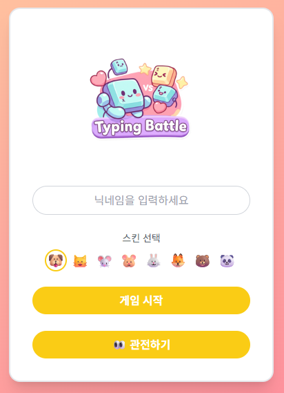

### 2. 관전 모드 화면

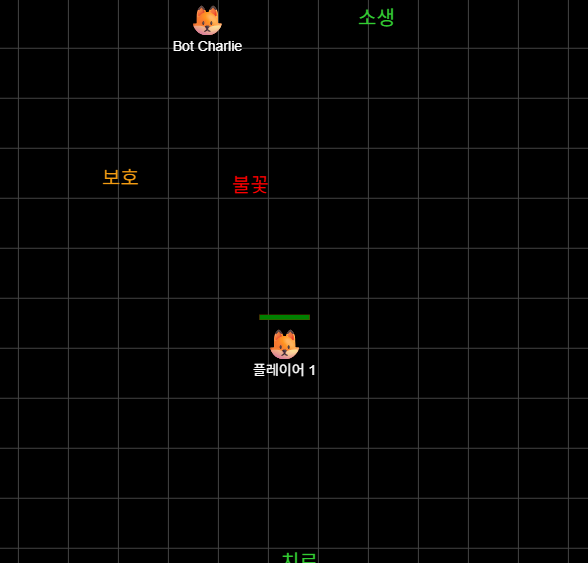

### 3. 게임 플레이 화면

<div style="display: flex; gap: 10px; align-items: flex-start;">
  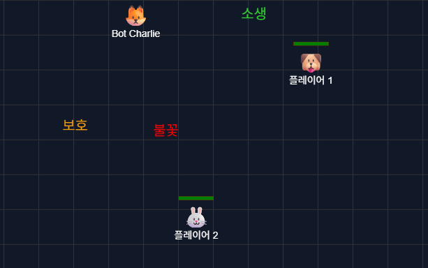
  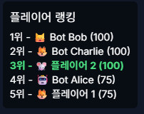
</div>

#### 공격

<div style="display: flex; gap: 10px; align-items: flex-start;">
  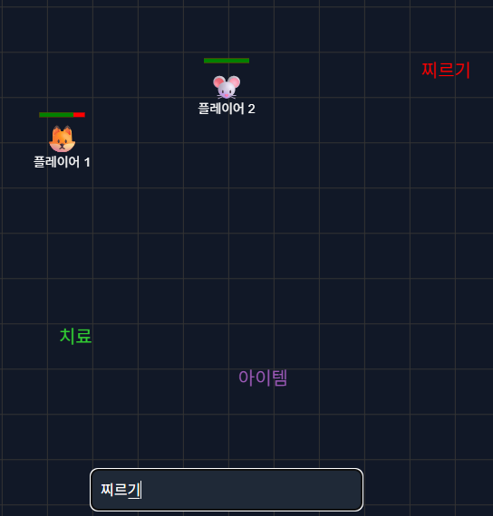
  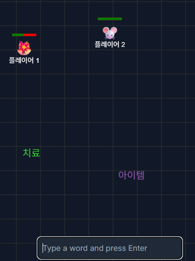
</div>

#### 회복

<div style="display: flex; gap: 10px; align-items: flex-start;">
  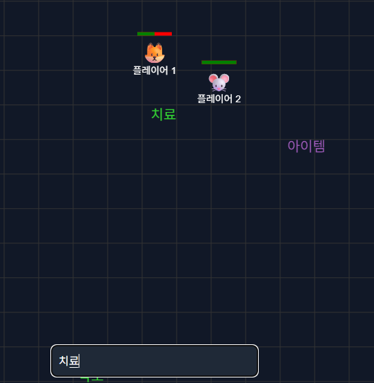
  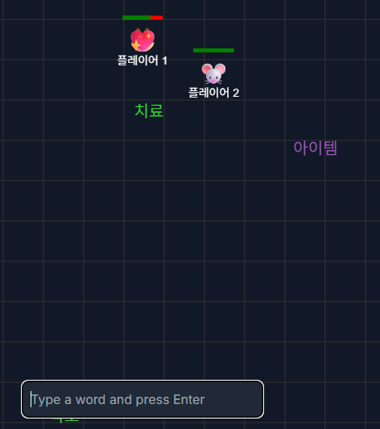
</div>

## 🏗 아키텍처

### 프론트엔드 아키텍처 (Next.js)

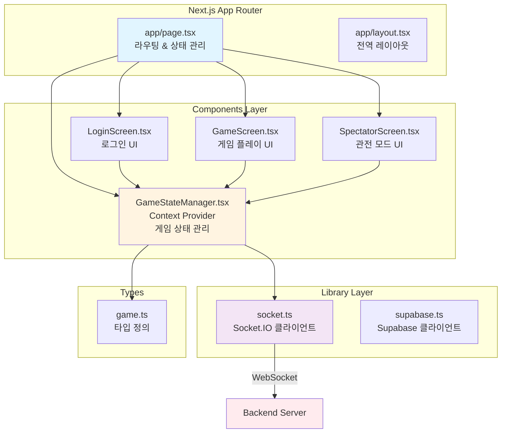

### 백엔드 아키텍처 (NestJS)

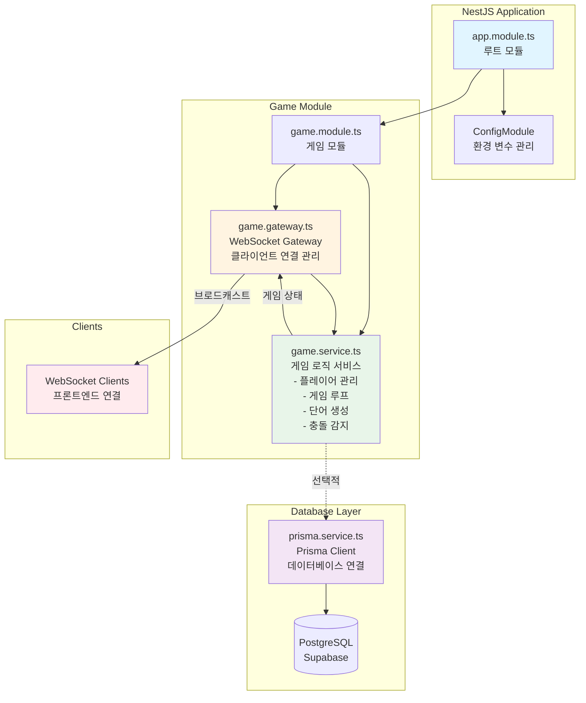

### 전체 시스템 아키텍처

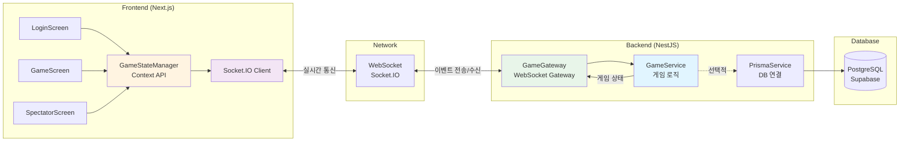

## 📁 디렉토리 구조

```
frontend/
├── app/                    # Next.js App Router
│   ├── page.tsx           # 메인 페이지 (라우팅)
│   └── layout.tsx         # 전역 레이아웃
├── components/            # React 컴포넌트
│   ├── GameScreen.tsx     # 게임 플레이 화면
│   ├── GameStateManager.tsx  # 게임 상태 관리 (Context)
│   ├── LoginScreen.tsx    # 로그인 화면
│   └── SpectatorScreen.tsx   # 관전 모드 화면
├── lib/                   # 유틸리티 라이브러리
│   ├── socket.ts          # Socket.IO 클라이언트
│   └── supabase.ts        # Supabase 클라이언트
├── types/                 # TypeScript 타입 정의
│   └── game.ts            # 게임 관련 타입
└── images/                # 이미지 리소스
```

```
backend/
├── src/                    # 소스 코드
│   ├── main.ts            # 애플리케이션 진입점
│   ├── app.module.ts      # 루트 모듈
│   ├── prisma.service.ts  # Prisma 데이터베이스 서비스
│   └── game/              # 게임 모듈
│       ├── game.module.ts    # 게임 모듈 정의
│       ├── game.gateway.ts   # WebSocket Gateway (클라이언트 연결 관리)
│       └── game.service.ts   # 게임 로직 서비스 (게임 상태, 플레이어 관리)
├── prisma/                # Prisma 스키마
│   └── schema.prisma     # 데이터베이스 스키마 정의
├── package.json           # 의존성 및 스크립트
└── tsconfig.json         # TypeScript 설정
```

## 📝 라이선스

이 프로젝트는 학습 목적으로 제작되었습니다.
